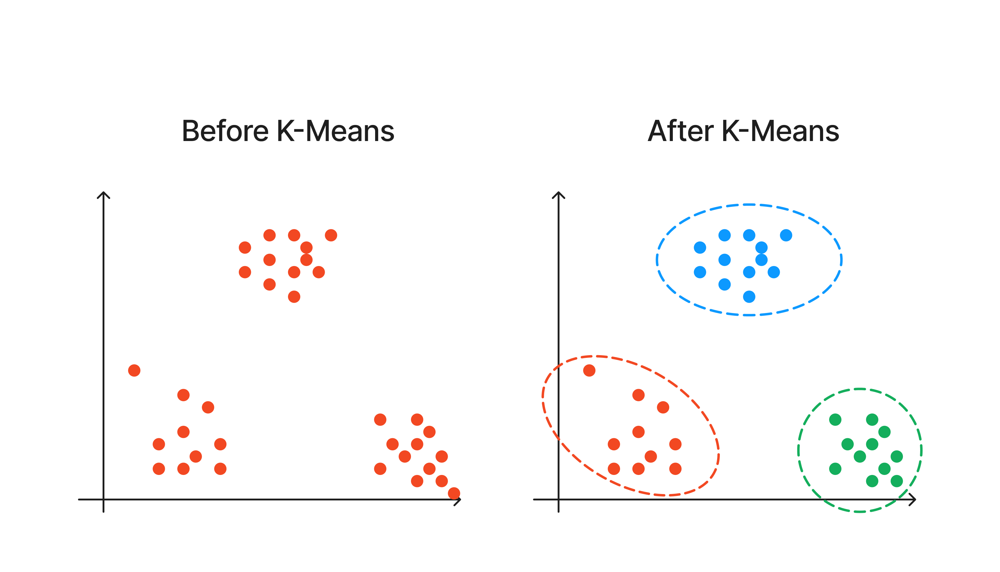
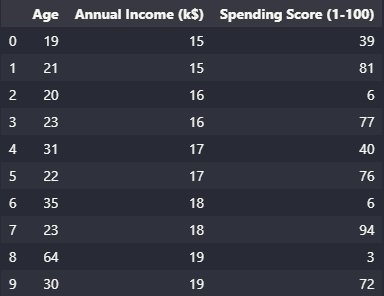
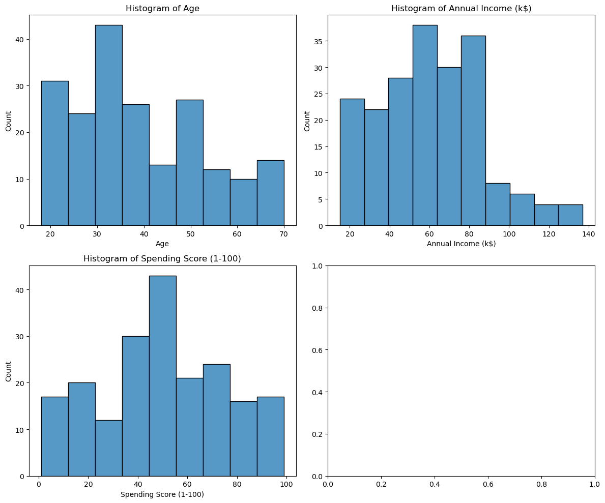
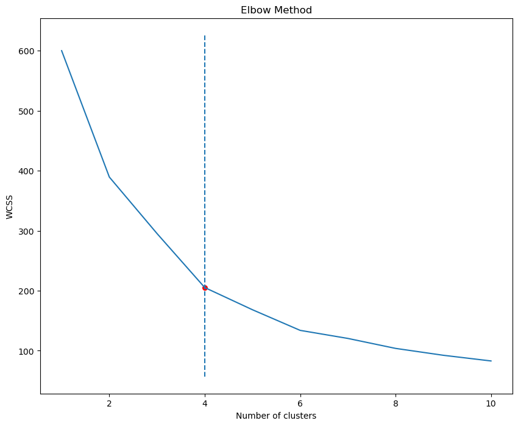
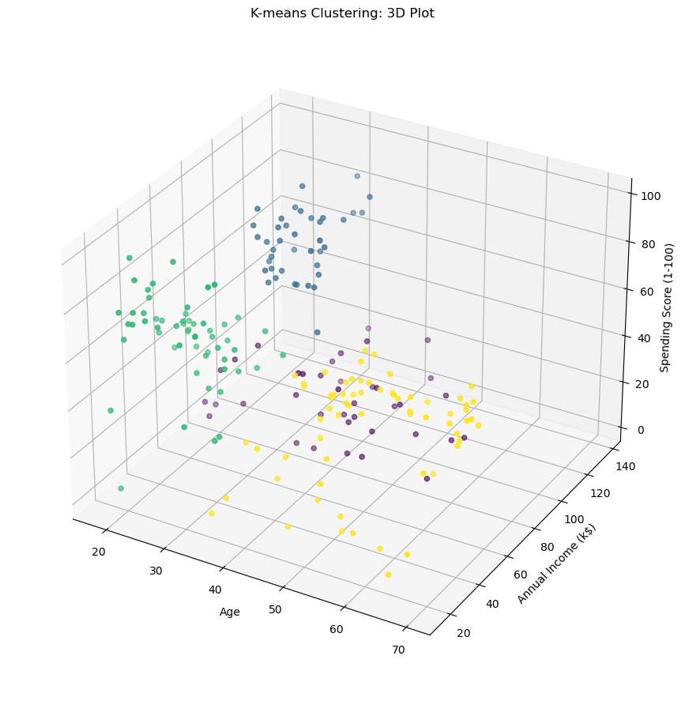

## Introduction

In this ever-evolving landscape of business and marketing, understanding customers has become more critical than ever before. The ability to unlock the secrets behind their preferences, behaviors, and needs holds the key to delivering personalized experiences and fostering long-lasting relationships. But how can we effectively make sense of a massive pool of customer data?

That's where customer segmentation comes into play. It is a fundamental aspect of marketing that involves dividing customers into distinct groups or segments based on their shared characteristics, behaviors, or needs. By effectively segmenting customers, businesses gain valuable insights into their target audience, enabling them to tailor their marketing efforts to cater to the specific desires and preferences of each segment. 

Customer segmentation allows businesses to go beyond a one-size-fits-all approach and dive deeper into understanding their customers' unique identities. By identifying similarities and patterns within different customer groups, organizations can develop targeted strategies that resonate on a more personal level.

Moreover, segmentation enables businesses to allocate their resources more efficiently. Instead of scattering marketing efforts across the entire customer base, they can focus on specific segments that offer the greatest potential for growth and profitability. This approach maximizes the impact of marketing initiatives, ensuring that resources are utilized effectively to yield the best possible results.

One of the most widely used techniques for customer segmentation is K-means clustering. In this blog post, we will explore K-means clustering in more detail. We will learn about the assumptions of K-means clustering, how to apply it using Python, and some of the limitations of the algorithm. By the end of this post, you will have a clear understanding of what K-means clustering is and how to use it in your own customer segmentation projects.

## What is K-Means Clustering?

K-means clustering is an unsupervised machine learning algorithm that groups data points into a predetermined number of clusters. It aims to group data points into distinct clusters based on their similarity. The "K" in K-means represents the number of clusters we want to create.

The algorithm works by iteratively assigning data points to the nearest cluster centroid and updating the centroids based on the newly formed clusters. It operates based on the assumption that similar data points should be closer to each other and that the centroid represents the center or average of the data points within its cluster.

Here's a simplified step-by-step explanation of how the K-means clustering algorithm works:

1. Randomly select K centroids, which act as the initial centers of the clusters.
2. Assign each data point to the nearest centroid based on a distance metric, often the Euclidean distance.
3. Recalculate the centroids by taking the average of the data points within each cluster.
4. Iterate the process of assignment and updating until convergence. Convergence occurs when the centroids no longer significantly change or a predefined number of iterations is reached.
5. Once convergence is reached, the algorithm assigns each data point to its corresponding cluster based on the final centroids.

The outcome of K-means clustering is a partitioning of the data into K distinct clusters, where data points within the same cluster are more similar to each other than to those in other clusters.



K-means clustering is widely used due to its simplicity, scalability, and interpretability. However, it is essential to choose the appropriate number of clusters (K) and pre-process the data adequately to obtain meaningful results. Additionally, it is worth noting that the algorithm assumes that clusters are spherical and have equal variance, which may not always hold true in real-world scenarios.

## K-Means Clustering in Python

In this tutorial, we will be using [Mall Customer Segmentation Data](https://www.kaggle.com/datasets/vjchoudhary7/customer-segmentation-tutorial-in-python) from Kaggle. This dataset contains some basic data about customers like age, gender, annual income and spending score. For this project we will only be using the numerical features (age, annual income, and spending score).

### Data Preparation

```python
import pandas as pd
import matplotlib.pyplot as plt
import seaborn as sns
from kneed import KneeLocator
from sklearn.cluster import KMeans
from sklearn.preprocessing import StandardScaler
```

```python
# Read the CSV file containing customer data into a DataFrame
df = pd.read_csv('data/Mall_Customers.csv')

# Select the desired features (Age, Annual Income, and Spending Score)
X = df[['Age', 'Annual Income (k$)', 'Spending Score (1-100)']]
```



Now, lets visualize the distribution of the features with histograms

```python
# Create a 2x2 grid of subplots
fig, axs = plt.subplots(2, 2)

# Flatten the subplots array into a 1D array
axs = axs.ravel()

# Iterate over the columns of the X DataFrame and their corresponding subplot axes
for i, col in enumerate(X.columns):
    # Plot a histogram of the current column on the corresponding subplot axis
    sns.histplot(X[col], ax=axs[i])
    
    # Set the title of the subplot to indicate the column name
    axs[i].set_title('Histogram of ' + col)

# Adjust the layout of the subplots to prevent overlapping
plt.tight_layout()

# Display the plot
plt.show()
```



Since the features are on different scales, it is necessary to scale them to have zero mean and unit variance. We will use the `StandardScaler` from `scikit-learn` to perform this task.

```python
# Create a StandardScaler object
scaler = StandardScaler()

# Scale the data using the fit_transform method
X_scaled = scaler.fit_transform(X)
```

### Determining the Optimal Number of Clusters

The next step is to determine the optimal number of clusters for the segmentation. For this, we will be utilizing the elbow method. The basic idea behind the elbow method is that increasing the number of clusters will result in a decrease in the within-cluster sum of squared distances (WCSS). Still, at some point, the decrease will no longer be significant enough to justify the increase in the number of clusters. 

The elbow method works by plotting the WCSS against the number of clusters and finding the point where the decrease in WCSS slows down, creating an elbow-like shape in the plot. This elbow-like shape indicates the optimal number of clusters, with the region before the elbow being under-fitting and the region after being over-fitting. 

The `kneed` library provides a simple and convenient way to determine the optimal number of clusters for a k-means clustering algorithm, without requiring manual inspection of the plot of WCSS against the number of clusters. The library provides a `KneeLocator` function that can be used to find the knee or elbow point in a given set of data, which can then be used to determine the optimal number of clusters.

```python
# compute WCSS for different values of k
wcss = []
for i in range(1, 11):
    kmeans = KMeans(n_clusters=i, random_state=42)
    kmeans.fit(X_scaled)
    wcss.append(kmeans.inertia_)

# plot WCSS vs no. of clusters
sns.lineplot(x=range(1, 11), y=wcss)
plt.title('Elbow Method')
plt.xlabel('Number of clusters')
plt.ylabel('WCSS')

# find the knee location
knee = KneeLocator(range(1, 11), wcss, curve='convex', direction='decreasing')

# plot the knee location
plt.vlines(knee.knee, plt.ylim()[0], plt.ylim()[1], linestyles='dashed')
plt.scatter(knee.knee, knee.knee_y, color='red', s=30)

plt.show()
```



The elbow method plot shows that the optimal number of clusters is 4, where the decrease in the within-cluster sum of squares (WCSS) is minimal.

### KMeans Clustering

Then, we instantiate a KMeans object with 4 clusters and fit it to the scaled data.

```python
# Instantiate a KMeans object with 4 clusters and a random state of 42
kmeans = KMeans(n_clusters=4, random_state=42)

# Fit the K-means model to the scaled data and obtain the cluster labels for each data point
y_kmeans = kmeans.fit_predict(X_scaled)
```

### Cluster Analysis

To effectively analyze and interpret the results of the clustering process, it is essential to integrate the cluster labels obtained from the K-means algorithm with the original dataset. This integration allows us to gain a comprehensive understanding of how each data point is assigned to a specific cluster, providing valuable insights into customer segmentation. By examining average age, annual income, and spending score, we can identify distinct traits and tendencies that define each segment.

```python
# add the cluster labels to the original data
df['cluster'] = y_kmeans

# analyze the characteristics of each customer segment
segment_summary = df.groupby('cluster').agg({
    'Age': 'mean',
    'Annual Income (k$)': 'mean',
    'Spending Score (1-100)': 'mean',
    'CustomerID': 'count'
}).rename(columns={
    'Age': 'Mean Age',
    'Annual Income (k$)': 'Mean Annual Income (k$)',
    'Spending Score (1-100)': 'Mean Spending Score (1-100)',
    'CustomerID': 'Number of Customers'
})
```


```python
fig = plt.figure(figsize=(10, 8))
ax = fig.add_subplot(111, projection='3d')

# Create a 3D scatter plot of the data points
ax.scatter3D(df['Age'], df['Annual Income (k$)'], df['Spending Score (1-100)'], c=df['cluster'], cmap='viridis')

# Set labels for each axis
ax.set_xlabel('Age')
ax.set_ylabel('Annual Income (k$)')
ax.set_zlabel('Spending Score (1-100)')

# Set a title for the plot
plt.title('K-means Clustering: 3D Plot')

ax.set_box_aspect(aspect=None, zoom=0.9)
plt.show()
```



We can now analyze and interpret the clustering results. We can explore the characteristics of each cluster, and evaluate their distinctiveness. 

For this tutorial, we can label these 4 clusters as follows:

1. Conservative Spenders: This segment includes customers with a higher average age and annual income, but a lower spending score. They may be more conservative with their spending and focused on saving their money.
2. Young and Wealthy: This segment includes customers with a lower average age and a high annual income and spending score. They are likely younger, wealthier customers who are more likely to spend on luxury goods and experiences.
3. Budget Shoppers: This segment includes customers with a lower average age and annual income, but a relatively high spending score. They may be focused on getting the most for their money and finding deals and discounts.
4. Middle-Aged Moderates: This segment includes customers with a higher average age and a moderate annual income and spending score. They may be more conservative with their spending than the Young and Wealthy segment, but still have more disposable income than the Budget Shoppers segment.

This is just an example on how to interpret the clusters. Remember that the interpretation of the clusters is subjective and may require domain knowledge or further analysis.

## Conclusion

In this blog post, we learned about customer segmentation using K-means clustering in Python. We explored the significance of understanding customers' preferences and behaviors. Through the implementation of K-means clustering, we discovered a practical and widely-used technique to cluster customers effectively. We examined the step-by-step process of applying K-means clustering in Python. By preprocessing the data, choosing the appropriate number of clusters, and utilizing the K-means algorithm, we obtained valuable insights into our customer segments.

In conclusion, customer segmentation through K-means clustering equips businesses with the tools to unlock the potential within their customer data. By gaining insights into distinct customer groups, organizations can tailor their marketing strategies, make data-driven decisions, and build strong connections with their customers. As the business landscape continues to evolve, harnessing the power of data science and customer segmentation becomes increasingly crucial in achieving sustainable growth and success.