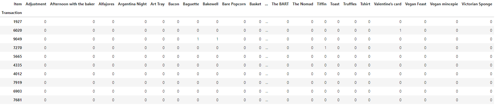
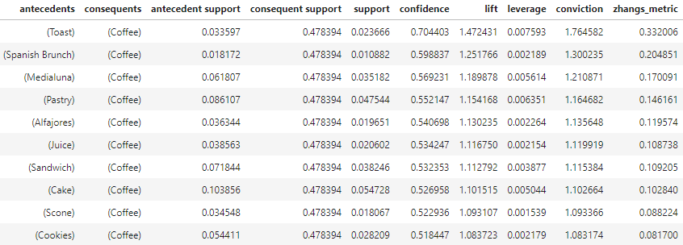

Market Basket Analysis is a powerful data mining technique that enables businesses to gain insights into customer purchasing patterns. By analyzing large datasets, such as purchase history, businesses can reveal product groupings and customer preferences. This technique became even more accessible with the adoption of electronic point-of-sale (POS) systems, which made it easier to collect transactional data and analyze customer behavior.

Market Basket Analysis is especially useful in industries like retail, e-commerce, and grocery, where customer behavior is complex and influenced by various factors. By identifying patterns and relationships between products, businesses can improve sales and customer satisfaction.

In this blog post, we will explore the use of association rule mining in Market Basket Analysis, with a focus on one of the most popular algorithms - the Apriori Algorithm. We will delve into the inner workings of the algorithm and understand how it can be applied to reveal patterns in customer purchase behavior.

## Association Rule Mining

One of the key techniques used in Market Basket Analysis is Association Rule Mining. Association Rule Mining is a powerful technique that can be used to identify interesting relationships between items in large datasets. It involves identifying frequent itemsets, which are sets of items that are often purchased or appear together in transactions, and then generating association rules that describe the relationships between these itemsets.

An association rule has two parts: an antecedent and a consequent. The antecedent is the set of items that appear on the left-hand side of the rule, while the consequent is the set of items that appear on the right-hand side. The antecedent and consequent are connected by the symbol "=>" which means "implies".

For example, consider the following association rule: {🍞, 🍰} => {☕}. In this rule, {🍞, 🍰} is the antecedent and {☕} is the consequent. This rule implies that customers who purchase bread and cake together are also likely to purchase coffee.

To determine which itemsets are frequent, we typically use three metrics: support, confidence, and lift

### Support

Support measures the frequency of occurrence of a particular itemset in the dataset. It is calculated as the number of transactions containing the itemset divided by the total number of transactions in the dataset. A high support value indicates that the itemset occurs frequently in the dataset and is therefore a good candidate for generating association rules.


For example, if we have 100 transactions in total and 20 of them include 🥐 and 🥖 together, the support for the association rule "🥐 -> 🥖" would be 20/100 = 0.2 or 20%.

### Confidence

Confidence measures the strength of the relationship between two items in an association rule. It is calculated as the number of transactions containing both items in the rule divided by the total number of transactions containing the first item in the rule. A high confidence value indicates that the second item is likely to be purchased when the first item is purchased.


For example, if we have 50 transactions that include 🥐, and 20 of those transactions also include 🥖, the confidence for the association rule "🥐 -> 🥖" would be 20/50 = 0.4 or 40%.

### Lift

Lift measures the degree of association between two items in an association rule, relative to the frequency of occurrence of both items. It is calculated as the support of the itemset containing both items divided by the product of the supports of the individual items in the rule. A lift value greater than 1 indicates a positive association between the items, while a value less than 1 indicates a negative association.


For example, if the support for "🥐 -> 🥖" is 0.2 (as in the example above), and the support for 🥐 alone is 0.6 and the support for 🥖 alone is 0.5, then the lift for "🥐 -> 🥖" would be (0.2) / (0.6 x 0.5) = 0.67.

## Apriori Algorithm

The Apriori algorithm is widely used in association rule mining because of its efficiency in discovering interesting relationships between items in large datasets. It employs a bottom-up approach to mine frequent itemsets and generates association rules that describe the relationships between them.

The Apriori algorithm prunes the search space of itemsets to focus only on those that are frequent, which significantly reduces the computational resources and time required to find frequent itemsets. This pruning helps to avoid the generation of irrelevant rules that would not be useful in practical applications.

The algorithm has two phases, where the first phase involves identifying all frequent itemsets that occur above a minimum threshold, also known as the support threshold. The second phase involves generating association rules between these frequent itemsets based on their support and confidence.

The algorithm starts by identifying all individual items in the dataset and their frequency of occurrence. It then generates candidate itemsets of length two by joining pairs of frequent items. It continues to generate candidate itemsets of increasing length until no new frequent itemsets are found.

In the second phase, the algorithm generates association rules between the frequent itemsets. An association rule is a statement of the form A -> B, where A and B are itemsets. The support of an association rule is the proportion of transactions in the dataset that contain both A and B, while the confidence of the rule is the proportion of transactions containing A that also contain B.

The Apriori algorithm uses support and confidence thresholds to filter out weak association rules. A high support threshold ensures that only frequent itemsets are considered, while a high confidence threshold ensures that only strong association rules are generated.

## Python Implementation

We will use “The Bread Basket” dataset from Kaggle. The dataset belongs to a bakery located in Edinburgh. The dataset has over 9000 transactions. For this analysis, we will only be using the `Transaction` and `Item` columns.

```python
import pandas as pd
from mlxtend.frequent_patterns import apriori, association_rules

df = pd.read_csv('data/bread basket.csv')

df = df[['Transaction', 'Item']]
```

The resulting dataframe is pivoted to create a matrix where the rows are transactions, the columns are unique items, and the values are the counts of each item in each transaction.

```python
# group the df by transaction and item, count the number of each item in each transaction
basket = df.groupby(
    by=['Transaction', 'Item']
    )['Item'].count().reset_index(name='Count')

# pivot the table to have transaction as rows and item names as columns
basket = basket.pivot_table(
    index='Transaction', 
    columns='Item', 
    values='Count', 
    aggfunc='sum').fillna(0).applymap(lambda x: 1 if x > 0 else 0)
```



Next, we use the Apriori algorithm from the `mlxtend` library to generate frequent itemsets. The `min_support` parameter is set to 0.01, which means that an itemset must appear in at least 1% of all transactions to be considered frequent. After generating frequent itemsets, we use the `association_rules` function from the same library to generate association rules between the frequent itemsets. The `min_threshold` parameter is set to 0.5, which means that only association rules with a confidence score of 50% or higher will be considered. Finally, we sort the association rules by lift and select the top 10 rules based on the highest lift score.

```python
# create frequent itemsets with a support of at least 0.01
frequent_itemsets = apriori(basket, min_support=0.01, use_colnames=True)

# generate association rules with a minimum confidence of 0.5
association_rules = association_rules(frequent_itemsets, metric='confidence', min_threshold=0.5)

# print the top 10 association rules by lift
top_10_rules = association_rules.sort_values(by='lift', ascending=False).head(10)
print(top_10_rules)
```



Based on the market basket analysis performed on the dataset, we were able to generate a set of association rules that have a confidence greater than 0.5 and a positive lift value. Among the rules generated, we identified the top 10 rules that were particularly important and interesting.

## Takeaways

**1.** Market Basket Analysis is a powerful data mining technique that can reveal patterns and relationships between products and customer preferences by analyzing large datasets such as purchase history.

**2.** Association Rule Mining is a key technique used in Market Basket Analysis to identify frequent itemsets and generate association rules that describe the relationships between them.

**3.** An association rule has two parts: an antecedent and a consequent, which are connected by the symbol "=>".

**4.** The Apriori algorithm is a widely used algorithm in association rule mining, as it efficiently discovers interesting relationships between items in large datasets.

**5.** The Apriori algorithm prunes the search space of itemsets to focus only on those that are frequent, which significantly reduces the computational resources and time required to find frequent itemsets.

**6.** The algorithm has two phases: identifying all frequent itemsets that occur above a minimum threshold and generating association rules between these frequent itemsets based on their support and confidence.

**7.** Support, confidence, and lift are metrics used to determine which itemsets are frequent and to filter out weak association rules.

**8.** A high support value indicates that the itemset occurs frequently in the dataset, while a high confidence value indicates that the second item is likely to be purchased when the first item is purchased.

**9.** Lift measures the degree of association between two items in an association rule, relative to the frequency of occurrence of both items. A lift value greater than 1 indicates a positive association between the items, while a value less than 1 indicates a negative association.

**10.** The Apriori algorithm uses support and confidence thresholds to filter out weak association rules, ensuring that only frequent and strong association rules are generated.