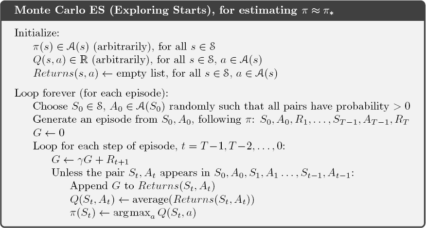
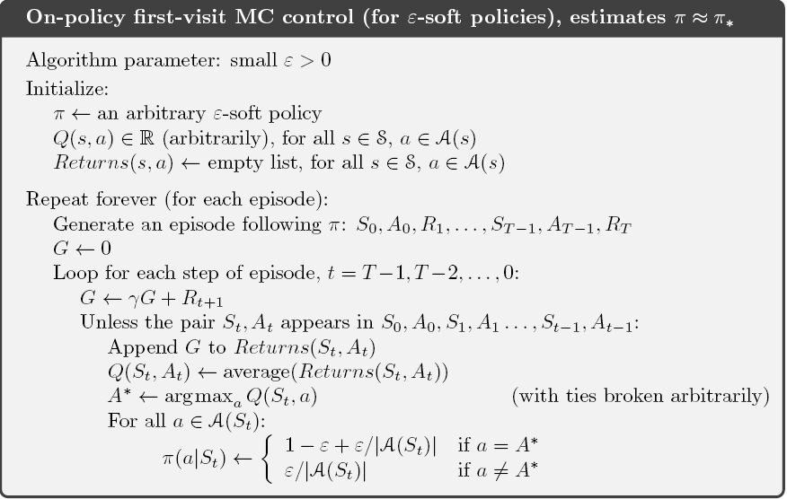

The Monte Carlo method represents a reinforcement learning technique used to estimate the value of a state or state-action pair by averaging the returns achieved from those states or state-actions. Unlike traditional methods that rely on iterative updates, Monte Carlo methods learn from complete episodes, making them well-suited for tasks with a defined endpoint. These methods accumulate knowledge from experience, collecting sequences of states, actions, and rewards from real or simulated interactions with an environment. Learning from actual experience doesn't require prior knowledge of the environment's dynamics and can lead to optimal behavior. Learning from simulated experience can also be powerful, requiring only the generation of sample transitions, not the complete probability distributions needed for dynamic programming (DP).

### Monte Carlo Prediction

When estimating the value of a state under a policy $\pi$, Monte Carlo methods typically average the returns observed after visiting that state. This averaging process converges to the expected value as more returns are collected. This concept forms the basis for all Monte Carlo methods.

For example, when estimating $v_\pi(s)$, the value of state $s$ under policy $\pi$, based on a set of episodes following $\pi$ and passing through $s$. Each occurrence of state $s$ in an episode is called a *visit* to $s$. The first-visit MC method estimates $v_\pi(s)$ as the average of the returns following
first visits to $s$, whereas the every-visit MC method averages the returns following all
visits to $s$. Both first-visit MC and every-visit MC converge to $v_\pi(s)$ as the number of visits to $s$tends toward infinity.

### Monte Carlo Estimation

For action values, the policy evaluation problem involves estimating $q_\pi(s, a)$, the expected return when starting in state $s$, taking action $a$, and following policy $\pi$. The methods for this are similar to those used for state values but now involve state-action pairs.

One complication of this method is that many state-action pairs may never be visited. If $\pi$ is
a deterministic policy, then in following $\pi$, we will observe returns only for one of the
actions from each state. With no returns to average, the Monte Carlo estimates of the
other actions will not improve with experience. This is a serious problem because the
purpose of learning action values is to help in choosing among the actions available in
each state. To compare alternatives we need to estimate the value of all the actions from
each state, not just the one we currently favor.

For policy evaluation to work for action values, we must assure continual exploration. One way to do this is by specifying that the episodes start in a state-action pair, and that every pair has a nonzero probability of being selected as the start. This guarantees that all state–action pairs will be visited an infinite number of times in the limit of an infinite number of episodes. This is called the assumption of exploring starts.

### Monte Carlo Control

Monte Carlo estimation can be applied to control problems to approximate optimal policies. This involves maintaining both an approximate policy and an approximate value function. The value function is iteratively updated to better approximate the value function for the current policy, while the policy is improved with respect to the current value function. These two processes may have opposing effects, but they collectively guide both policy and value function towards optimality.

$$
\pi_0 \xrightarrow{\text{E}} q_{\pi0} \xrightarrow{\text{I}} \pi_1 \xrightarrow{\text{E}} q_{\pi1} \xrightarrow{\text{I}} \pi_2 \xrightarrow{\text{E}}  ... 
\xrightarrow{\text{I}} \pi_* \xrightarrow{\text{E}} q_*
$$

where $\xrightarrow{\text{E}}$ denotes a complete policy evaluation and $\xrightarrow{\text{I}}$ denotes a complete policy improvement. Policy evaluation is done as described in the preceding section. Policy improvement is done by making the policy greedy with respect to the current value function. For any action-value function $q$, the corresponding greedy policy is the one that deterministically chooses an action with maximum action-value.

$$
\pi(s) = \arg \max_a q(s, a)
$$

Policy improvement then can be done by constructing each $\pi_{k+1}$ as the greedy policy with respect to $q_{\pi_k}$. The policy improvement theorem then applies to $\pi_k$ and $\pi_{k+1}$ because, for all $s \in S$,

$$
\begin{align}
q_{\pi_k}(s, \pi_{k+1}(s)) &= q_{\pi_k}(s, \arg \max_a q_{\pi_k}(s, a)) \\\
&= \max_a q_{\pi_k}(s, a) \\\
&\geq q_{\pi_k}(s, \pi_k(s)) \\\
&\geq v_{\pi_k}(s)
\end{align}
$$

The policy improvement theorem ensures that each updated policy ($\pi_{k+1}$) is uniformly better or equally good as the previous one ($\pi_k$). This process continues until convergence to the optimal policy and optimal value function is achieved.

### Control without Exploring Starts

Control without the need for exploring initial states is a goal in reinforcement learning to avoid relying on the impractical assumption of starting from all possible initial conditions. Achieving this entails ensuring that the agent continues to select all possible actions throughout its learning process. There are two principal approaches to guaranteeing this: on-policy methods and off-policy methods. On-policy methods aim to evaluate or improve the policy used to make decisions, while off-policy methods involve evaluating or improving a policy that differs from the one used to collect the data.

In on-policy methods, the policy is typically "soft,”, meaning that $\pi(a \mid s) \gt 0$ for all $s \in S$ and $a \in A(s)$. Over time, the policy gradually transitions closer to a deterministic optimal policy. An example of a soft policy is the $\epsilon\text{-greedy}$ policies, where most of the time, the agent selects the action with the highest estimated value, but occasionally, with a probability $\epsilon$, the agent choose random action instead. All non-greedy actions are given the minimal probability of selection, $\epsilon \over \left|A(s)\right|$ , while the remaining probability, $1 - \epsilon + {\epsilon \over \left|A(s)\right|}$, is given to the greedy action.

### Off-policy Prediction via Importance Sampling

All learning control methods face a dilemma: They seek to learn action values conditional on subsequent optimal behavior, but they need to behave non-optimally in order to explore all actions (to find the optimal actions). How can they learn about the optimal policy while behaving according to an exploratory policy? A more straightforward approach is to employ two policies, one that is being learned (the target policy) and becomes optimal over time, and another that is more exploratory and generates the agent's behavior (the behavior policy). Learning occurs "off" the target policy, and this overall process is termed off-policy learning.

We start by considering the prediction problem, in which both target and behavior policies are fixed. Suppose we wish to estimate $v_\pi$ or $q_\pi$, but all we have are episodes following another policy $b$, where $b \neq \pi$. In this case, $\pi$ is the target policy, and $b$ is the behavior policy. In order to use episodes from $b$ to estimate values for $\pi$, we require that every action taken under $\pi$ is also taken, at least occasionally, under $b$. This is called the assumption of coverage. It follows from coverage that $b$ must be stochastic in states where it is not identical to $\pi$. The target policy $\pi$, on the other hand, may be deterministic.

Almost all off-policy methods utilize importance sampling, a general technique for estimating expected values under one distribution given samples from another. We apply importance sampling to off-policy learning by weighting returns according to the relative probability of their trajectories occurring under the target and behavior policies, called the importance-sampling ratio. Given a starting state $S_t$, the probability of the subsequent state-action trajectory, $A_t, S_{t+1}, A_{t+1}, ..., S_T$, occurring under any policy $\pi$ is,

$$
\begin{align}
Pr\{A_t, S_{t+1}, A_{t+1}, ..., S_T \mid S_t, A_{t:T-1} \sim \pi\} 
&= \pi(A_t \mid S_t)p(S_{t+1} \mid S_t, A_t)\pi(A_{t+1} \mid S_{t+1})...p(S_T \mid S_{T-1}, A_{T-1}) \\\
&= \prod_{k=t}^{T-1} \pi(A_k \mid S_k)p(S_{k+1} \mid S_k, A_k) 
\end{align}
$$

where $p$ is the state-transition probability function. Thus, the importance sampling ratio is,

$$
\begin{align}
\rho_{t:T-1} &= {\prod_{k=t}^{T-1} \pi(A_k \mid S_k)p(S_{k+1} \mid S_k, A_k) \over \prod_{k=t}^{T-1} b(A_k \mid S_k)p(S_{k+1} \mid S_k, A_k)} \\\
&= \prod_{k=t}^{T-1}{\pi(A_k \mid S_k) \over b(A_k \mid S_k)}
\end{align}
$$

Recall that we wish to estimate the expected returns (values) under the target policy, but all we have are returns $G_t$ due to the behavior policy. These returns have the wrong expectation and cannot be averaged to obtain $V_\pi$. This is where importance sampling comes in. The ratio $\rho_{t:T-1}$transforms the returns to have the right expected value:

$$
\mathbb{E}[\rho_{t:T-1}G_t \mid S_t=s] = v_\pi(s)
$$

There are two main types of importance sampling: ordinary importance sampling and weighted importance sampling. In ordinary importance sampling, we use the sampled values to estimate expected values or probabilities under the target distribution. Let $\mathcal{T}(s)$ denote the set of all time steps in which state $s$ is visited. Also, let $T(t)$ denote the first time of termination following time $t$, and $G_t$ denote the return after $t$ up through $T(t)$. Then $\{G_t\}_{t \in \mathcal{T}(s)}$ are the returns that pertain to state $s$, and $\{\rho_{t:T(t)-1}\}_{t \in \mathcal{T}(s)}$ are the importance-sampling ratios. To estimate $v_\pi(s)$, we scale the returns by the ratios and average the results.

$$
V(S) = {\sum_{t \in \mathcal{T}(s) } \rho_{t:T(t)-1} G_t \over \left|\mathcal{T}(s)\right|}
$$

Weighted importance sampling improves upon ordinary importance sampling by introducing weights that adjust for the discrepancies between the importance distribution and the target distribution. These weights ensure that samples drawn from the importance distribution contribute appropriately to the estimate.

$$
V(S) = {\sum_{t \in \mathcal{T}(s) } \rho_{t:T(t)-1} G_t \over \sum_{t \in \mathcal{T}(s) } \rho_{t:T(t)-1}}
$$

Ordinary importance sampling is unbiased whereas weighted importance sampling is biased (though the bias converges asymptotically to zero). On the other hand, the variance of ordinary importance sampling is in general unbounded because the variance of the ratios can be unbounded, whereas in the weighted estimator the largest weight on any single return is one.

## References

[1] Reinforcement Learning: An Introduction by Richard S. Sutton and Andrew G. Barto