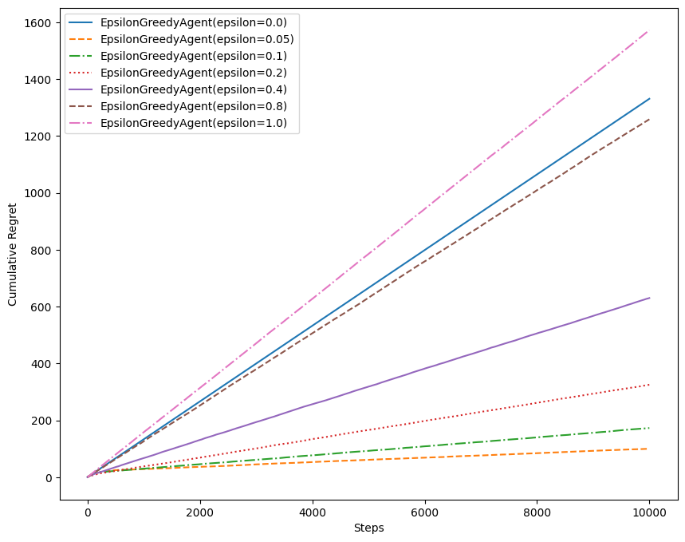
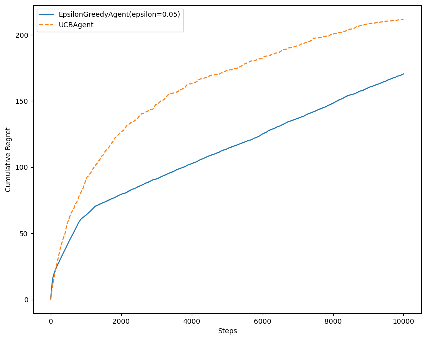
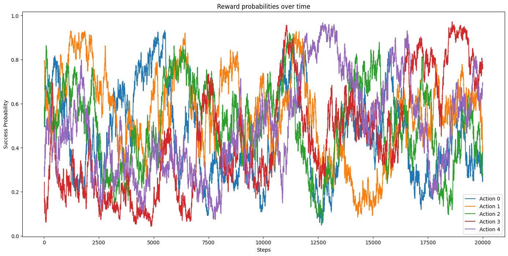
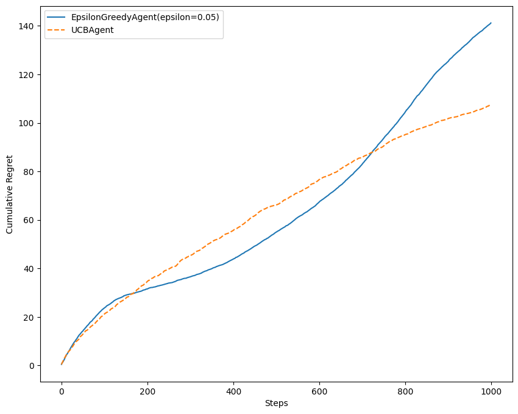
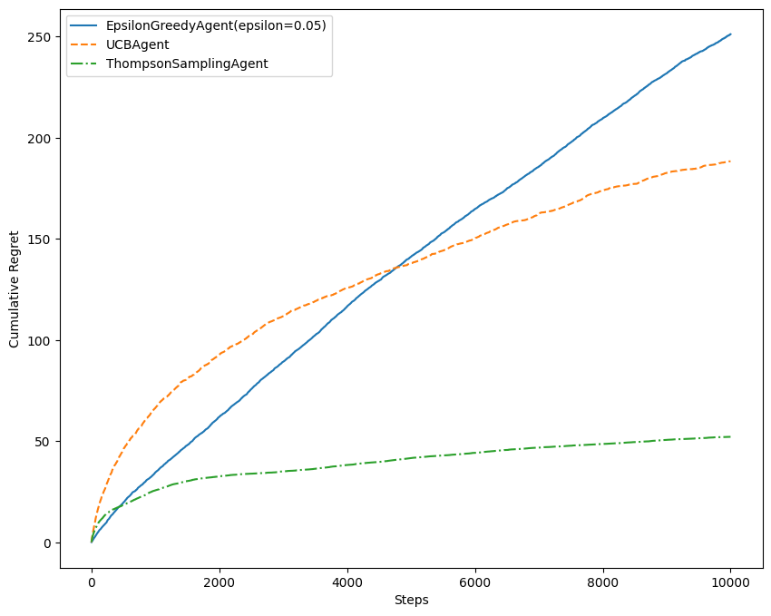
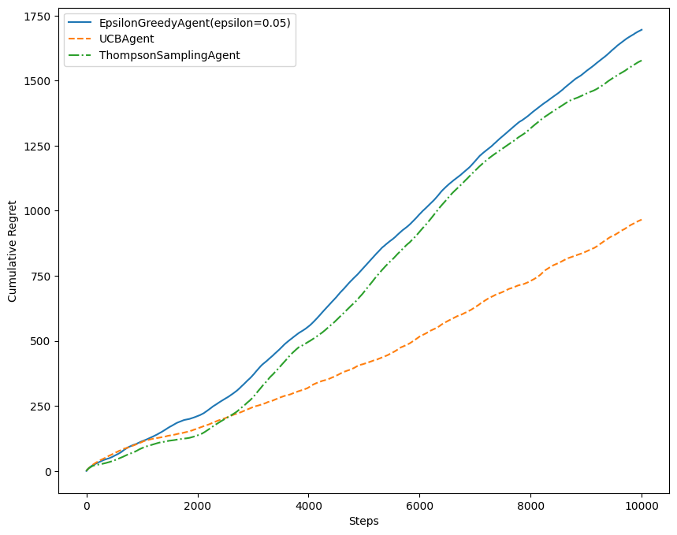

In probability theory and decision-making under uncertainty, the multi-armed bandit problem presents a challenge where a limited set of resources must be wisely allocated among competing choices to maximize the expected gain. This is a classic reinforcement learning problem that perfectly embodies the *exploration vs exploitation dilemma*.

Imagine we are facing a row of slot machines (also called [one-armed bandits](https://en.wiktionary.org/wiki/one-armed_bandit)). We must make a series of decisions: which arms to play, how many times to play each arm, the order in which to play them, and whether to stick with the current arm or switch to another one. In this setup, each arm provides a random reward from an unknown probability distribution. Our primary objective is to maximize the total reward obtained over a series of plays.

As we do not know the probability distributions, a straightforward strategy is to simply select the arm given a uniform distribution; that is, select each arm with the same probability. Over time, we will eventually manage to estimate the true reward probability according to the [law of large numbers](https://en.wikipedia.org/wiki/Law_of_large_numbers). But here's the catch: we need to spend enormous time trying out every action. Why not we only focus on the most promising actions given the reward we received so far?


## Exploration vs Exploitation

We want to play only the good actions; so just keep playing the actions that have given us the best reward so far. However, at first, we do not have information to tell us what the best actions are. We need strategies that *exploit* what we think are the best actions so far, but still *explore* other actions.

Now, the big question is: how much should we exploit and how much should we explore? This is known as the exploration vs exploitation dilemma. It's tricky because we don't have all the information we need. We want to gather enough data to make smart decisions overall while keeping the risks in check. Exploitation means using what we know works best, while exploration involves taking some risks to learn about actions we're not familiar with. 

In the context of the multi-armed bandit problem, we want exploration strategies that minimize the regret, which is the expected loss from not taking the best action. A zero-regret strategy is a strategy where the average regret of each round approaches zero as the number of rounds approaches infinity. This means, a zero-regret strategy will converge to an optimal strategy given enough rounds.


## Bernoulli Bandit

We are going to implement several exploration strategies for the simplest multi-armed bandit problem: Bernoulli Bandit. The bandit has $K$ actions. The action produces a reward, $r=1$, with probability $0 \le \theta_k \le 1$, which is unknown to the agent, but fixed over time. The objective of the agent is to minimize regret over a fixed number of action selections, $T$.

$$
\rho = T \theta^* - \sum_{t=1}^T \theta_{\alpha_t}
$$

$$
\text{where } \theta^* = \max_k{\theta_k} \text{; and } \\\theta_{\alpha_t} \text{ corresponds to the chosen action } \alpha_t \text{ at each step}
$$

```python
class BernoulliBandit:
    def __init__(self, n_actions=5):
        self._probs = np.random.random(n_actions)

    @property
    def action_count(self):
        return len(self._probs)

    def pull(self, action):
        if np.any(np.random.random() > self._probs[action]):
            return 0.0
        return 1.0

    def optimal_reward(self):
        return np.max(self._probs)

    def action_value(self, action):
        return self._probs[action]
    
    def step(self):
        pass

    def reset(self):
        pass
```

The implementation for each strategy that will be discuss inherits from the `AbstractAgent` class:

```python
class AbstractAgent(metaclass=ABCMeta):
    def init_actions(self, n_actions):
        self._successes = np.zeros(n_actions)
        self._failures = np.zeros(n_actions)
        self._total_pulls = 0

    @abstractmethod
    def get_action(self):
        pass

    def update(self, action, reward):
        self._total_pulls += 1
        if reward == 1:
            self._successes[action] += 1
        else:
            self._failures[action] += 1

    @property
    def name(self):
        return self.__class__.__name__
```

## Epsilon-greedy

The epsilon-greedy strategy is a simple and effective way to balance exploration and exploitation. The parameter $\epsilon \in [0,1]$ controls how much the agent explores and how much will it exploit. 

According to this strategy, with a small probability $\epsilon$, the agent takes a random action, but most of the time, with probability $1 - \epsilon$, the agent will pick the best action learned so far. The best $\epsilon$ value depends on the particular problem, but typically, values around 0.05 to 0.1 work very well.

```python
class EpsilonGreedyAgent(AbstractAgent):
    def __init__(self, epsilon=0.01):
        self._epsilon = epsilon

    def get_action(self):
        if np.random.random() < self._epsilon:
            return np.random.randint(len(self._successes))
        else:
            return np.argmax(self._successes / (self._successes + self._failures + 0.1))
```

The following plot shows the regret for each step, averaged over 10 trials.



Higher values of epsilon tend to have a higher regret over time. Higher value means more exploration, so the agent spends more time exploring less valuable actions, even though it already has a good estimate of the value of actions. In this particular problem, the epsilon value of 0.05 to 0.1 is a reasonable choice.


## Upper Confidence Bound

The epsilon-greedy strategy has no preference for actions and is inefficient in exploration. The agent might explore a bad action which is already been confirmed as a bad action in the past. It would be better to select among actions that are uncertain or have the potential to be optimal. One can come up with an idea of index for each action that represents optimality and uncertainty at the same time. One efficient way to do it is to use the UCB1 algorithm.

In each iteration, the agent assesses each available action's potential by calculating a weight ($w_k$) that combines estimates of both optimality and uncertainty.

$$
w_k = {\alpha_k \over \alpha_k + \beta_k} + \sqrt{2 \log t \over \alpha_k + \beta_k}
$$

The first term ${\alpha_k \over \alpha_k + \beta_k}$ represents the estimated success probability (optimality). The second term $\sqrt{2 \log t \over \alpha_k + \beta_k}$ represents the uncertainty, encouraging exploration.

After calculating weights for all actions, the agent then will choose with the maximum weight.

```python
class UCBAgent(AbstractAgent):
    def get_action(self):
        pulls = self._successes + self._failures + 0.1
        return np.argmax(self._successes / pulls + np.sqrt(2 * np.log(self._total_pulls + 0.1) / pulls))
```

In a static environment, epsilon-greedy might outperform UCB1 initially because epsilon-greedy is straightforward and tends to quickly focus on the arm with the highest estimated mean reward. UCB1, in contrast, might spend more time exploring and being cautious due to its confidence bounds.



But, in many real problems, the underlying probability distributions are not static. For example, suppose we employ a recommendation system for streaming content, using multi-armed bandit approach to decide which shows to suggest to users. In this scenario, the reward is measured by user engagement, specifically whether they watch the suggested show. The viewing preferences of our audience may evolve over time, influenced by factors such as trending genres, seasonal changes, and more. 

Here is an example of a nonstationary bandit where the reward probabilities change over time.

```python
class DriftingBandit(BernoulliBandit):
    def __init__(self, n_actions=5, gamma=0.01):
        super().__init__(n_actions)

        self._gamma = gamma

        self._successes = None
        self._failures = None
        self._steps = 0

        self.reset()

    def reset(self):
        self._successes = np.zeros(self.action_count) + 1.0
        self._failures = np.zeros(self.action_count) + 1.0
        self._steps = 0

    def step(self):
        action = np.random.randint(self.action_count)
        reward = self.pull(action)
        self._step(action, reward)

    def _step(self, action, reward):
        self._successes = self._successes * (1 - self._gamma) + self._gamma
        self._failures = self._failures * (1 - self._gamma) + self._gamma
        self._steps += 1

        self._successes[action] += reward
        self._failures[action] += 1.0 - reward

        self._probs = np.random.beta(self._successes, self._failures)
```



We can see from the plot how the reward probabilities change over time.



UCB1 shines in a changing environment because of its ability to adapt. As the distribution of rewards changes over time, UCB1 continues to explore arms with uncertain estimates, preventing it from getting stuck on a suboptimal arm.

## Thompson Sampling

Unlike the UCB1 algorithm, Thompson Sampling incorporates the actual distribution of rewards by sampling from a Beta distribution for each action. The Beta distribution is a flexible choice, as it is defined on the interval $[0, 1]$, making it suitable for representing probabilities.

In each iteration, the algorithm samples from a Beta distribution for each available action. These samples provide estimates of the true success probability for each action. The algorithm then selects the action with the highest sampled value. This approach allows Thompson Sampling to adapt to the true underlying distribution of rewards and make more informed decisions over time.

```python
class ThompsonSamplingAgent(AbstractAgent):
    def get_action(self):
        return np.argmax(np.random.beta(self._successes + 1, self._failures + 1))
```

From these comparison plots, we can see that Thompson Sampling performs really well compared to epsilon-greedy and UCB1.



In a static environment, the algorithm continuously refines its probability distributions based on observed outcomes. As it converges to the true underlying distribution, the algorithm becomes adept at exploiting the arm with the highest expected reward. 



In a dynamic environment, its ability to update beliefs in a Bayesian manner allows it to swiftly adapt to changes in the reward distribution.